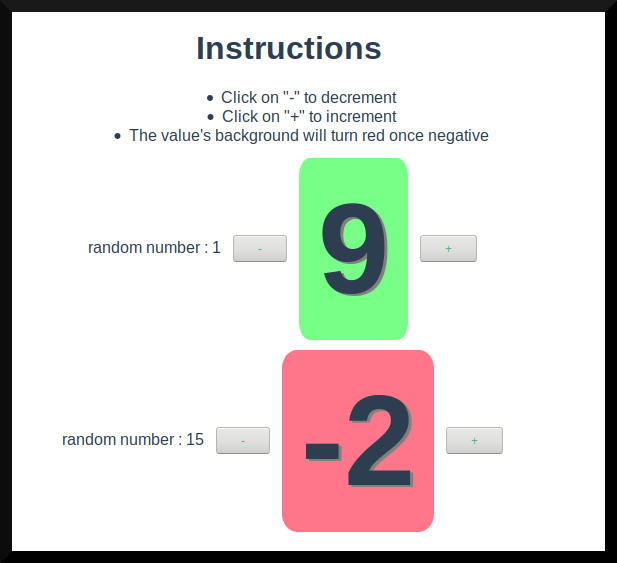

# Simple Vue.js demo using TypeScript classes


Displays a component whose background turns red when a value in it goes negative

## Project setup
```
npm install
```

### Compiles and hot-reloads for development
```
npm run serve
```

### Compiles and minifies for production
```
npm run build
```
Then go to
```
http://localhost:8080/demo
```
